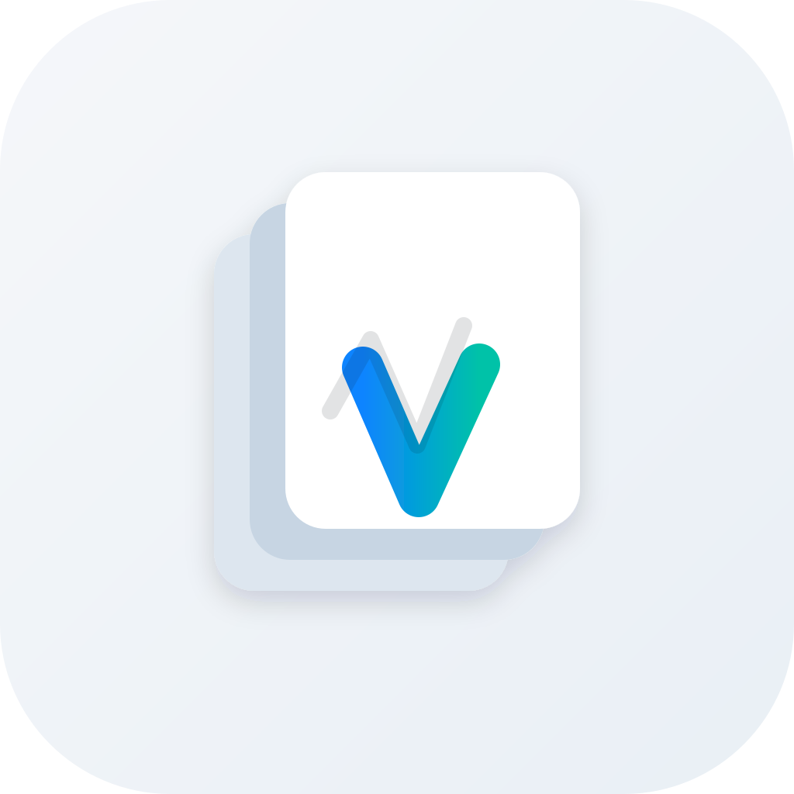

<a id="readme-top"></a>

**Languages:** [English](README.md) | [Русский](README.ru.md)

<!-- PROJECT SHIELDS -->
[![Contributors][contributors-shield]][contributors-url]
[![Forks][forks-shield]][forks-url]
[![Stargazers][stars-shield]][stars-url]
[![Issues][issues-shield]][issues-url]
[![License][license-shield]][license-url]
[![GitHub][github-shield]][github-url]

<!-- PROJECT LOGO -->
<br />
<div align="center">
  <a href="https://github.com/vvadev/vibe-deck">
    
  </a>

  <h3 align="center">Vibe Deck</h3>

  <p align="center">
    Virtual Stream Deck for vibe-coding: mobile app turns your phone into a programmable control deck, desktop app receives and executes actions.
    <br />
    <a href="https://github.com/vvadev/vibe-deck"><strong>Explore the docs »</strong></a>
    <br />
    <br />
    <a href="https://github.com/vvadev/vibe-deck">View Repository</a>
    &middot;
    <a href="https://github.com/vvadev/vibe-deck/issues/new?labels=bug">Report Bug</a>
    &middot;
    <a href="https://github.com/vvadev/vibe-deck/issues/new?labels=enhancement">Request Feature</a>
  </p>
</div>

<!-- TABLE OF CONTENTS -->
<details>
  <summary>Table of Contents</summary>
  <ol>
    <li>
      <a href="#about-the-project">About The Project</a>
      <ul>
        <li><a href="#built-with">Built With</a></li>
      </ul>
    </li>
    <li>
      <a href="#getting-started">Getting Started</a>
      <ul>
        <li><a href="#prerequisites">Prerequisites</a></li>
        <li><a href="#installation">Installation</a></li>
      </ul>
    </li>
    <li><a href="#usage">Usage</a></li>
    <li><a href="#roadmap">Roadmap</a></li>
    <li><a href="#contributing">Contributing</a></li>
    <li><a href="#license">License</a></li>
    <li><a href="#contact">Contact</a></li>
    <li><a href="#acknowledgments">Acknowledgments</a></li>
  </ol>
</details>

<!-- ABOUT THE PROJECT -->
## About The Project

<!-- [![Product Name Screen Shot][product-screenshot]][screenshots-url] -->

Vibe Deck is a two-app Flutter system for controlling desktop workflows from a phone on a local network:

* `mobile_app` (iOS/Android) scans LAN hosts, pairs with a desktop by one-time code, renders a configurable deck (up to 24 buttons), and sends button triggers.
* `desktop_app` (macOS/Windows/Linux) hosts WebSocket API (`ws://<host>:4040/ws`), validates pairing/session security, and executes allowed actions (`insert_text`, `hotkey`, `run_action`).
* Deck profile is normalized and synchronized from desktop to mobile via `deck_state` messages; non-removable locked `Enter` button is always enforced.

Logo PNG: [mobile_app/assets/vibe-deck-logo.png](https://github.com/vvadev/vibe-deck/blob/main/mobile_app/assets/vibe-deck-logo.png)

Screenshots placeholder:
* `docs/screenshots/overview.png` (main UI overview)
* `docs/screenshots/mobile-deck.png` (mobile deck tab)
* `docs/screenshots/desktop-actions.png` (desktop allowlist/actions tab)

Use this README as the main quick-start for both apps in this repository.

<p align="right">(<a href="#readme-top">back to top</a>)</p>

### Built With

* [![Flutter][Flutter.dev]][Flutter-url]
* [![Dart][Dart.dev]][Dart-url]
* [![Provider][Provider.dev]][Provider-url]
* [![WebSocket][WebSocket.dev]][WebSocket-url]
* [![Material][Material.dev]][Material-url]

<p align="right">(<a href="#readme-top">back to top</a>)</p>

<!-- GETTING STARTED -->
## Getting Started

Follow these steps to run desktop host and mobile controller locally.

### Prerequisites

* Flutter SDK with Dart `^3.9.2` (Flutter stable channel)
  ```sh
  flutter --version
  ```
* Platform toolchains for your targets:
  * Xcode for iOS/macOS
  * Android SDK for Android
  * Visual Studio (Desktop C++) for Windows
  * CMake + GTK tooling for Linux Flutter desktop

### Installation

1. Clone the repository
   ```sh
   git clone https://github.com/vvadev/vibe-deck.git
   cd vibe-deck
   ```
2. Install desktop app dependencies
   ```sh
   cd desktop_app
   flutter pub get
   ```
3. Install mobile app dependencies
   ```sh
   cd ../mobile_app
   flutter pub get
   ```
4. (Optional) Validate Flutter setup
   ```sh
   flutter doctor
   ```
5. Keep `origin` set to your repo if you fork:
   ```sh
   git remote -v
   ```

<p align="right">(<a href="#readme-top">back to top</a>)</p>

<!-- USAGE EXAMPLES -->
## Usage

1. Start desktop host:
   ```sh
   cd desktop_app
   flutter run -d macos
   ```
   Use `-d windows` or `-d linux` for other desktop targets.

2. Start mobile controller:
   ```sh
   cd mobile_app
   flutter run -d ios
   ```
   Use `-d android` for Android.

3. Pairing flow:
   * Open desktop app and copy pair code.
   * In mobile app open Connect tab, discover host or enter host/IP manually.
   * Enter pair code and complete pairing.
   * Open Deck tab and trigger buttons.

4. Security/runtime behavior:
   * Hello handshake challenge is required before pairing.
   * Session token is required for `trigger` and `health_ping`.
   * Pair attempts are rate-limited and can be temporarily locked.
   * `run_action` works only for desktop allowlist actions; shell mode is disabled by default.

For implementation details, inspect:
* `/desktop_app/lib/src/app_state.dart`
* `/desktop_app/lib/src/executor.dart`
* `/mobile_app/lib/src/data/ws_client.dart`
* `/mobile_app/lib/src/data/discovery_service.dart`

<p align="right">(<a href="#readme-top">back to top</a>)</p>

<!-- CONTRIBUTING -->
## Contributing

Contributions are welcome and appreciated.

If you have an idea to improve Vibe Deck, open an issue first or submit a pull request directly.

1. Fork the project
2. Create your feature branch (`git checkout -b feature/AmazingFeature`)
3. Commit your changes (`git commit -m 'Add some AmazingFeature'`)
4. Push to the branch (`git push origin feature/AmazingFeature`)
5. Open a Pull Request

<p align="right">(<a href="#readme-top">back to top</a>)</p>

<!-- LICENSE -->
## License

License is currently not specified in this repository. Add a `LICENSE` file to define distribution terms.

<p align="right">(<a href="#readme-top">back to top</a>)</p>

<!-- CONTACT -->
## Contact

Vladimir Versinin - [@vvadev](https://t.me/vvadev)

Project Link: [https://github.com/vvadev/vibe-deck](https://github.com/vvadev/vibe-deck)

<p align="right">(<a href="#readme-top">back to top</a>)</p>

<!-- MARKDOWN LINKS & IMAGES -->
[contributors-shield]: https://img.shields.io/github/contributors/vvadev/vide-deck.svg?style=for-the-badge
[contributors-url]: https://github.com/vvadev/vide-deck/graphs/contributors
[forks-shield]: https://img.shields.io/github/forks/vvadev/vide-deck.svg?style=for-the-badge
[forks-url]: https://github.com/vvadev/vide-deck/network/members
[stars-shield]: https://img.shields.io/github/stars/vvadev/vide-deck.svg?style=for-the-badge
[stars-url]: https://github.com/vvadev/vide-deck/stargazers
[issues-shield]: https://img.shields.io/github/issues/vvadev/vide-deck.svg?style=for-the-badge
[issues-url]: https://github.com/vvadev/vide-deck/issues
[license-shield]: https://img.shields.io/github/license/vvadev/vide-deck.svg?style=for-the-badge
[license-url]: https://github.com/vvadev/vide-deck/blob/main/LICENSE
[github-shield]: https://img.shields.io/badge/GitHub-vvadev-181717?style=for-the-badge&logo=github
[github-url]: https://github.com/vvadev
